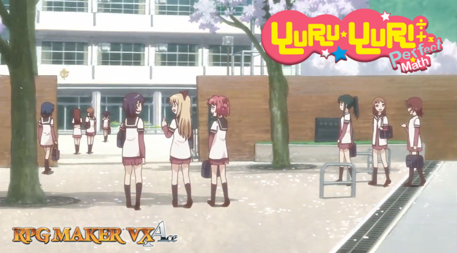
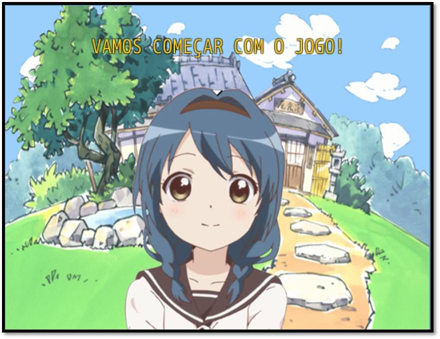
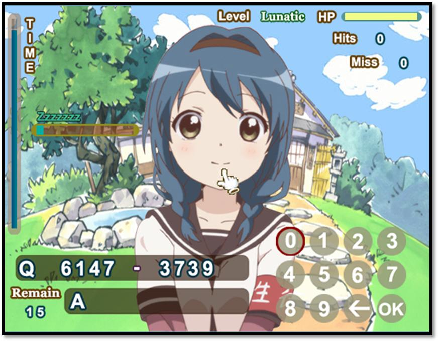
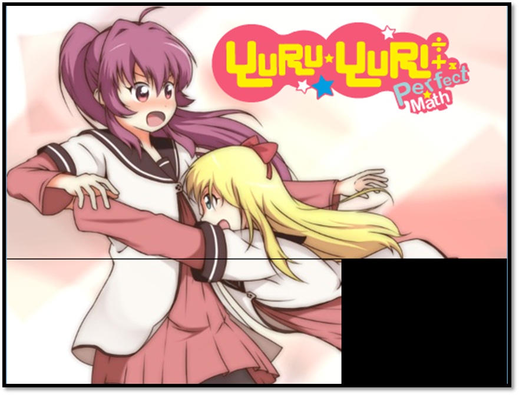
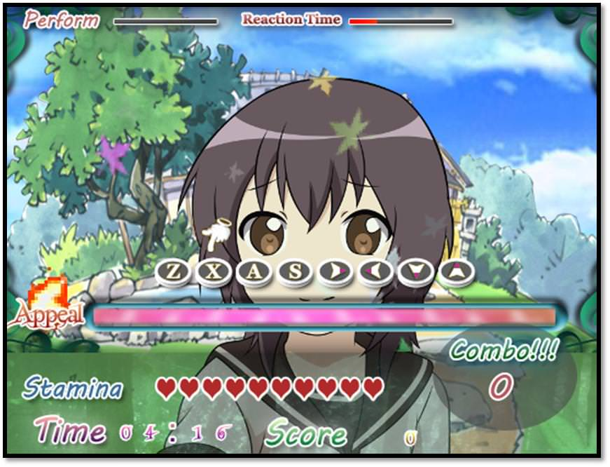

# game
## Game Educativo - Yuru Yuri - Perfect Math Plus 

  

 
Bem-vindo(a) ao jogo Educacional denominado <strong>Yuru Yuri Perfect Math Plus.</strong>

Como você já sabe, a Matemática é uma parte importante de sua vida. Ela está presente em todos os lugares, inclusive nos Games. Jogo desenvolvido com especificações ao complemento do estudo da Matemática em sua casa, no laser, abordando o Ensino Fundamental do 6° ao 9° ano. Yuru Yuri Perfect Math promovendo conteúdo para o 6° e 7° ano e Yuru Yuri Perfect Math Plus promovendo conteúdo para o 8° e 9° ano.

Gostaria muito de que aceitasse este convite para testar o jogo, participando ativamente de todos os desafios propostos. Vamos Começar?

## Screenshot do Game

  

## QUIZ PERFECT MATH

  

 É o principal Mini Game do jogo. Aborda problemas matemáticos para o jogador treinar e exercitar suas habilidades e conhecimento. Ao completa-lo será exibido um encerramento no formato de cutscenes do anime Yuru Yuri (assim como a abertura do jogo) e seguido para os créditos finais.

## YURUYURI - PERFECT MATH
  

Mini Game Matemático, na qual o objetivo é responder corretamente as perguntas dentro do limite do tempo. Contém quatro níveis de dificuldades: Fácil, Normal, Difícil e Lunático.

## SLIDING PUZZLE GAME

  

Mini Game que consiste em mover blocos até que a imagem esteja completa. Contém quatro modelos com as personagens do anime.

## YURUYURI MELODIA

  

Mini Game com sistema de música, efeitos visuais e jogabilidade rápida e simples. Contém Três modelos com as personagens do anime, além disso, possui três níveis de dificuldades: Fácil, Normal e Difícil.
 

## Ficha Técnica

<ul>
    <li><strong>Criador:</strong> Ronaldo Bento</li>
    <li><strong>Gênero:</strong> Educativo MatemáticoPuzzle Quiz</li>
    <li><strong>Engine:</strong> RPG Maker VX Ace</li>
    <li><strong>Design e Characters & Scenario: </strong>from Yuru Yuri</li>
    <li><strong>Design Logos:</strong> Bruce Azkan</li>
    <li><strong>Idioma:</strong> Português Brasileiro</li>
    <li><strong>Testadores:</strong> Romeo Charlie Lima/Bruna/Junior de Sousa/Gustavo M. Queiróz</li>
    <li><strong>Início do projeto:</strong> 30/09/2017</li>
    <li><strong>Lançamento do projeto:</strong> 03/11/2017</li>
    <li><strong>Duração do jogo:</strong> aproximadamente 40 minutos</li>
</ul>

<a href="https://condadobraveheart.com/threads/yuru-yuri-perfect-math-plus.2840/" target="_blank" rel="external" title="Clique aqui para entrar no site do projeto Educacional"><strong>Clique aqui para entrar no site do projeto Educacional ou utilize o QR Code abaixo</strong></a> 

 
